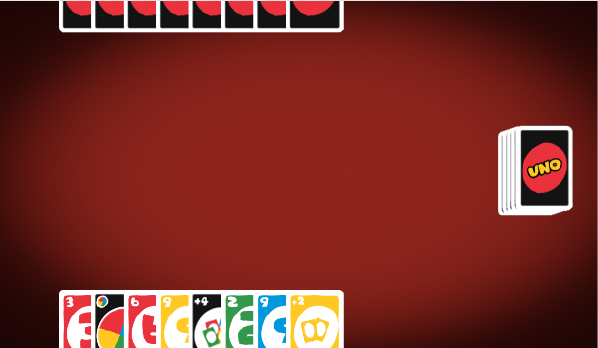

# UNO Game

Welcome to the UNO Game! This is a digital version of the classic card game UNO, built using Python and Pygame. Challenge the bot and see if you can win!

## Features

- **Smooth Animations**: Enjoy smooth card animations for drawing and playing cards.
- **Bot Opponent**: Play against a bot that follows the rules of UNO.
- **Game Over Screen**: Displays a victory or defeat screen with options to play again or quit.
- **Card Effects**: Includes special cards like Draw 2, Skip, Wild, and Wild Draw 4.

## Screenshots



## Installation

1. **Clone the repository**:
    ```bash
    git clone https://github.com/thenishantsapkota/uno-pygame.git
    cd uno-pygame
    ```

2. **Install the required dependencies**:
    ```bash
    pip install -r requirements.txt
    ```

3. **Run the game**:
    ```bash
    python game.py
    ```

## How to Play

- **Objective**: Be the first player to get rid of all your cards.
- **Gameplay**:
  - Players take turns to match a card from their hand with the top card of the discard pile by either color or number.
  - Special cards have unique effects:
    - **Draw 2**: The next player draws 2 cards and loses their turn.
    - **Skip**: The next player loses their turn.
    - **Wild**: Change the current color.
    - **Wild Draw 4**: Change the current color and the next player draws 4 cards and loses their turn.
- **Winning**: The first player to play all their cards wins the game.

## Controls

- **Mouse Click**: Select and play cards, draw cards from the deck.

## Contributing

Contributions are welcome! If you have any suggestions or improvements, feel free to create a pull request or open an issue.

## License

This project is licensed under the MIT License. See the LICENSE file for details.

## Acknowledgements

- [Pygame](https://www.pygame.org/) - The library used for creating the game.
- UNO is a trademark of Mattel. This project is a fan-made implementation and is not affiliated with Mattel.

---

Enjoy the game and have fun!